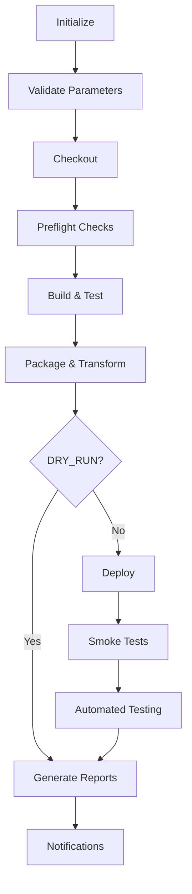

# WeSign Jenkins Deployment Pipeline

**Version 2.0** | **Last Updated: 2025-09-26** | **Author: DevOps Team**

> **Complete Windows-optimized CI/CD pipeline for WeSign application deployment with QA Intelligence backend integration**

## 🚀 Overview

This Jenkins pipeline provides enterprise-grade deployment automation for the WeSign application to Windows DevTest environments. It features comprehensive integration with the QA Intelligence backend API, automated testing, rollback capabilities, and extensive monitoring.

### Key Features

- ✅ **Windows-Optimized**: Built specifically for Windows Jenkins → Windows IIS deployment
- ✅ **QA Intelligence Integration**: Full API integration for status reporting and orchestration
- ✅ **Security-First**: Jenkins Credentials Plugin with domain authentication
- ✅ **SMB/WinRM Deployment**: No Jenkins agent required on target servers
- ✅ **Automated Testing**: API tests (Newman) and E2E tests (Playwright)
- ✅ **Smart Rollback**: Automatic rollback on failure with health verification
- ✅ **Comprehensive Monitoring**: Health checks, smoke tests, and performance baselines
- ✅ **Audit Trail**: Full deployment tracking and compliance reporting

## 📁 File Structure

```
├── Jenkinsfile                              # Main pipeline definition
├── vars/
│   └── wesignDeploy.groovy                 # Reusable pipeline library
├── jenkins/
│   ├── environment.properties              # Environment configuration
│   └── scripts/
│       ├── Deploy-WeSignApplication.ps1    # Main deployment script
│       ├── Test-WeSignHealth.ps1           # Health check script
│       └── Invoke-WeSignRollback.ps1       # Emergency rollback script
└── JENKINS_PIPELINE_README.md              # This documentation
```

## 🔧 Setup Instructions

### 1. Jenkins Prerequisites

#### Required Plugins
```bash
# Install these Jenkins plugins:
- Pipeline: Groovy
- Pipeline: Stage View
- Credentials Plugin
- Email Extension Plugin
- HTML Publisher Plugin
- Test Results Analyzer
- Build Timeout
- AnsiColor
- Timestamper
```

#### Required Tools on Jenkins Server
```powershell
# .NET SDK 8.0
# PowerShell 5.1+
# Git for Windows
# Newman (npm install -g newman newman-reporter-html)
# Python 3.12+ with pip
```

### 2. Jenkins Credentials Setup

Create these credentials in Jenkins Credentials Manager:

| Credential ID | Type | Description |
|--------------|------|-------------|
| `wesign-domain-service-account` | Username/Password | Domain service account for authentication |
| `wesign-devtest-deploy-user` | Username/Password | DevTest server deployment user |
| `qa-intelligence-backend-token` | Secret Text | QA Intelligence API token |
| `gitlab-wesign-deploy-key` | SSH Username with private key | GitLab deploy key |
| `wesign-e2e-test-credentials` | Username/Password | E2E test user credentials |
| `teams-webhook-wesign-deployment` | Secret Text | Teams webhook URL (optional) |

### 3. Pipeline Library Configuration

1. **Add Pipeline Library** in Jenkins:
   - Go to: Manage Jenkins → Configure System → Global Pipeline Libraries
   - Name: `wesign-deployment`
   - Default version: `main`
   - Retrieval method: Modern SCM → Git
   - Project repository: (This repository)

2. **Or use local library**:
   - Copy `vars/wesignDeploy.groovy` to `${JENKINS_HOME}/vars/`

### 4. Environment Configuration

1. **Update `jenkins/environment.properties`**:
   ```properties
   # Customize these values for your environment
   DEVTEST_SERVER=your-devtest-server.domain.local
   DEVTEST_SHARE=\\\\your-devtest-server\\WeSignDeploy$
   QA_BACKEND_URL=http://your-qa-backend:8082
   ```

2. **Copy to Jenkins**:
   ```powershell
   # Copy configuration to Jenkins workspace
   mkdir "${env:JENKINS_HOME}\wesign-deployment"
   copy jenkins\environment.properties "${env:JENKINS_HOME}\wesign-deployment\"
   ```

### 5. Target Server Setup

#### Windows DevTest Server Requirements

1. **IIS Configuration**:
   ```powershell
   # Enable IIS features
   Enable-WindowsOptionalFeature -Online -FeatureName IIS-WebServerRole
   Enable-WindowsOptionalFeature -Online -FeatureName IIS-WebServer
   Enable-WindowsOptionalFeature -Online -FeatureName IIS-CommonHttpFeatures
   Enable-WindowsOptionalFeature -Online -FeatureName IIS-HttpErrors
   Enable-WindowsOptionalFeature -Online -FeatureName IIS-HttpRedirect
   Enable-WindowsOptionalFeature -Online -FeatureName IIS-ApplicationDevelopment
   Enable-WindowsOptionalFeature -Online -FeatureName IIS-NetFxExtensibility45
   Enable-WindowsOptionalFeature -Online -FeatureName IIS-HealthAndDiagnostics
   Enable-WindowsOptionalFeature -Online -FeatureName IIS-HttpLogging
   Enable-WindowsOptionalFeature -Online -FeatureName IIS-Security
   Enable-WindowsOptionalFeature -Online -FeatureName IIS-RequestFiltering
   Enable-WindowsOptionalFeature -Online -FeatureName IIS-Performance
   Enable-WindowsOptionalFeature -Online -FeatureName IIS-WebServerManagementTools
   Enable-WindowsOptionalFeature -Online -FeatureName IIS-ManagementConsole
   Enable-WindowsOptionalFeature -Online -FeatureName IIS-IIS6ManagementCompatibility
   Enable-WindowsOptionalFeature -Online -FeatureName IIS-Metabase
   Enable-WindowsOptionalFeature -Online -FeatureName IIS-ASPNET45
   ```

2. **Create IIS Site and App Pool**:
   ```powershell
   Import-Module WebAdministration

   # Create Application Pool
   New-WebAppPool -Name "WeSignAppPool"
   Set-ItemProperty -Path "IIS:\AppPools\WeSignAppPool" -Name "processModel.identityType" -Value "ApplicationPoolIdentity"
   Set-ItemProperty -Path "IIS:\AppPools\WeSignAppPool" -Name "recycling.periodicRestart.time" -Value "01:00:00"

   # Create Website
   New-Website -Name "WeSign" -Port 443 -PhysicalPath "C:\inetpub\wwwroot\WeSign" -ApplicationPool "WeSignAppPool"
   ```

3. **SMB Share Setup**:
   ```powershell
   # Create deployment share
   New-Item -ItemType Directory -Path "C:\WeSignDeploy" -Force
   New-SmbShare -Name "WeSignDeploy$" -Path "C:\WeSignDeploy" -FullAccess "DOMAIN\jenkins-deploy-user"
   ```

4. **WinRM Configuration**:
   ```powershell
   # Enable WinRM
   Enable-PSRemoting -Force
   Set-WSManInstance -ResourceURI winrm/config/service -ValueSet @{AllowUnencrypted="true"}
   Set-WSManInstance -ResourceURI winrm/config/service/auth -ValueSet @{Basic="true"}

   # Configure HTTPS (recommended)
   New-SelfSignedCertificate -DnsName "your-devtest-server" -CertStoreLocation "Cert:\LocalMachine\My"
   # Configure HTTPS listener with the certificate
   ```

## 🎮 Pipeline Usage

### Pipeline Parameters

| Parameter | Type | Default | Description |
|-----------|------|---------|-------------|
| `BRANCH_OR_TAG` | Choice | `main` | Branch or tag to deploy (supports wildcards) |
| `DRY_RUN` | Boolean | `false` | Perform dry run without actual deployment |
| `TEST_SUITE` | Choice | `api` | Test suite to execute (`api`, `e2e`, `full`, `none`) |
| `FORCE_DEPLOY` | Boolean | `false` | Force deployment even if health checks fail |
| `SKIP_BACKUP` | Boolean | `false` | Skip backup creation (not recommended) |
| `NOTIFICATION_RECIPIENTS` | String | `devops@company.com` | Email notification recipients |

### Pipeline Stages



### Running the Pipeline

1. **Standard Deployment**:
   ```
   Branch/Tag: main
   Dry Run: false
   Test Suite: api
   ```

2. **Full Testing Deployment**:
   ```
   Branch/Tag: develop
   Dry Run: false
   Test Suite: full
   ```

3. **Dry Run for Validation**:
   ```
   Branch/Tag: feature/new-feature
   Dry Run: true
   Test Suite: none
   ```

## 🔗 QA Intelligence Integration

### API Integration Points

The pipeline integrates with QA Intelligence backend at multiple stages:

| Stage | Endpoint | Purpose |
|-------|----------|---------|
| Initialize | `POST /api/wesign/unified/execute` | Register deployment |
| Status Updates | `PUT /api/wesign/unified/execute/{id}/status` | Report stage status |
| Health Checks | `GET /api/wesign/unified/health` | System health validation |
| Completion | `POST /api/wesign/unified/rollback` | Final status and artifacts |

### Status Reporting Schema

```json
{
  "executionId": "uuid-string",
  "stage": "deployment|testing|completed",
  "status": "running|completed|failed",
  "message": "Human readable status",
  "timestamp": "2025-09-26 14:30:22",
  "metadata": {
    "duration": 120.5,
    "packageFile": "WeSign-123.zip",
    "testResults": {...}
  }
}
```

## 🧪 Testing Integration

### API Testing (Newman)

The pipeline automatically runs Postman collections using Newman:

```javascript
// Example test collection structure
{
  "info": { "name": "WeSign API Tests" },
  "item": [
    {
      "name": "Health Check",
      "request": {
        "method": "GET",
        "url": "{{baseUrl}}/health"
      },
      "event": [{
        "listen": "test",
        "script": {
          "exec": [
            "pm.test('Status is healthy', function () {",
            "  pm.response.to.have.status(200);",
            "  pm.expect(pm.response.json().status).to.eql('healthy');",
            "});"
          ]
        }
      }]
    }
  ]
}
```

### E2E Testing (Playwright + pytest)

Python-based E2E tests using Playwright:

```python
# Example E2E test
import pytest
from playwright.sync_api import Page, expect

def test_wesign_login_flow(page: Page):
    page.goto("https://devtest-server/")
    page.fill("#username", "testuser")
    page.fill("#password", "testpass")
    page.click("#login-button")
    expect(page.locator("#dashboard")).to_be_visible()
```

## 🔄 Rollback Procedures

### Automatic Rollback

The pipeline performs automatic rollback if:
- Deployment fails during extraction/copying
- Smoke tests fail (unless `FORCE_DEPLOY=true`)
- Health checks fail after deployment

### Manual Rollback

Use the PowerShell rollback script:

```powershell
# Emergency rollback to latest backup
.\jenkins\scripts\Invoke-WeSignRollback.ps1 `
  -TargetPath "C:\inetpub\wwwroot\WeSign" `
  -IISSite "WeSign" `
  -IISAppPool "WeSignAppPool" `
  -RollbackReason "Critical production issue" `
  -QABackendUrl "http://localhost:8082"

# Rollback to specific backup
.\jenkins\scripts\Invoke-WeSignRollback.ps1 `
  -BackupPath "C:\Backups\WeSign\wesign-backup-20251225-143022.zip" `
  -TargetPath "C:\inetpub\wwwroot\WeSign" `
  -IISSite "WeSign" `
  -IISAppPool "WeSignAppPool" `
  -RollbackReason "Rollback to stable version"
```

## 📊 Monitoring and Observability

### Health Check Endpoints

The pipeline validates these endpoints:

| Endpoint | Purpose | Critical |
|----------|---------|----------|
| `/` | Main application page | Yes |
| `/health` | Basic health check | Yes |
| `/api/health` | API health status | Yes |
| `/api/wesign/unified/health` | WeSign module health | Yes |
| `/api/health/database` | Database connectivity | No |

### Health Check Script Usage

```powershell
# Basic health check
.\jenkins\scripts\Test-WeSignHealth.ps1 -BaseUrl "https://devtest-server"

# Extended health check with performance tests
.\jenkins\scripts\Test-WeSignHealth.ps1 `
  -BaseUrl "https://devtest-server" `
  -IncludeExtended `
  -Detailed `
  -OutputFormat Json `
  -OutputFile "health-report.json"
```

### Metrics and Logging

The pipeline generates comprehensive metrics:

- **Deployment Duration**: End-to-end deployment time
- **Build Metrics**: Build time, package size, test results
- **Performance Baselines**: Response times for key endpoints
- **Success Rates**: Deployment success rate over time
- **Error Tracking**: Categorized failure reasons

## 🔐 Security Considerations

### Credential Management

- **Never hardcode credentials** in pipeline files
- Use Jenkins Credentials Plugin for all sensitive data
- Rotate credentials regularly (recommended: 90 days)
- Use service accounts with minimal required permissions

### Network Security

- **WinRM over HTTPS** preferred (port 5986)
- **SMB v3** with encryption for file transfers
- **Firewall rules** to restrict access to deployment ports
- **VPN/Private network** for Jenkins ↔ DevTest communication

### Audit and Compliance

- **Full audit trail** of all deployments via QA Intelligence
- **Change tracking** with git commit information
- **Approval workflows** for production deployments
- **Security scanning** integration (optional)

## 🚨 Troubleshooting

### Common Issues

#### 1. "Cannot ping DevTest server"
**Cause**: Network connectivity issues
**Solution**:
```powershell
# Test connectivity
Test-NetConnection -ComputerName devtest-server -Port 445  # SMB
Test-NetConnection -ComputerName devtest-server -Port 5986 # WinRM HTTPS
Test-NetConnection -ComputerName devtest-server -Port 5985 # WinRM HTTP
```

#### 2. "SMB share access denied"
**Cause**: Authentication or permission issues
**Solution**:
```powershell
# Test SMB access manually
$credential = Get-Credential
New-PSDrive -Name "Test" -PSProvider FileSystem -Root "\\devtest-server\WeSignDeploy$" -Credential $credential
```

#### 3. "WinRM authentication failed"
**Cause**: WinRM configuration or credential issues
**Solution**:
```powershell
# Test WinRM connectivity
Test-WSMan -ComputerName devtest-server -Port 5986 -UseSSL
# Or for HTTP:
Test-WSMan -ComputerName devtest-server -Port 5985
```

#### 4. "IIS Application Pool won't start"
**Cause**: Application errors, missing dependencies, or configuration issues
**Solution**:
```powershell
# Check Windows Event Logs
Get-WinEvent -LogName Application | Where-Object {$_.Id -eq 1000} | Select-Object -First 5
Get-WinEvent -LogName System | Where-Object {$_.Id -eq 7034} | Select-Object -First 5

# Check IIS logs
Get-Content "C:\inetpub\logs\LogFiles\W3SVC1\*.log" | Select-Object -Last 50
```

#### 5. "QA Intelligence backend not responding"
**Cause**: Backend service issues or network connectivity
**Solution**:
```powershell
# Test backend connectivity
Invoke-RestMethod -Uri "http://localhost:8082/health" -Method GET
# Check backend service status
Get-Service -Name "QA-Intelligence-Backend" -ErrorAction SilentlyContinue
```

### Debug Mode

Enable debug logging in the pipeline:

```groovy
environment {
    DEBUG_ENABLED = 'true'
    VERBOSE_OUTPUT = 'true'
}
```

### Log Locations

| Component | Log Location |
|-----------|-------------|
| Jenkins Pipeline | Jenkins build console output |
| Deployment Script | `%TEMP%\WeSign-Deployment-*.log` |
| Health Check Script | `%TEMP%\WeSign-Health-*.log` |
| Rollback Script | `%TEMP%\WeSign-Rollback-*.log` |
| IIS Application | `C:\inetpub\logs\LogFiles\W3SVC1\` |
| Windows Event Log | Event Viewer → Windows Logs → Application |

## 📚 Additional Resources

### Documentation Links

- [Jenkins Pipeline Syntax](https://www.jenkins.io/doc/book/pipeline/syntax/)
- [PowerShell for DevOps](https://docs.microsoft.com/en-us/powershell/)
- [IIS Management with PowerShell](https://docs.microsoft.com/en-us/powershell/module/webadministration/)
- [WinRM Configuration](https://docs.microsoft.com/en-us/windows/win32/winrm/installation-and-configuration-for-windows-remote-management)

### Related Projects

- **QA Intelligence Backend**: Main backend API for test orchestration
- **WeSign Application**: Target application being deployed
- **Playwright Test Suite**: E2E testing framework
- **Newman/Postman**: API testing collections

### Support Contacts

| Role | Contact | Responsibility |
|------|---------|---------------|
| **DevOps Lead** | devops-lead@company.com | Pipeline architecture, Jenkins configuration |
| **QA Team** | qa-team@company.com | Test automation, QA Intelligence integration |
| **Platform Team** | platform@company.com | Infrastructure, Windows server management |
| **Security Team** | security@company.com | Security reviews, credential management |

---

## 🎯 Quick Start Checklist

- [ ] Jenkins plugins installed
- [ ] Pipeline library configured
- [ ] Credentials created in Jenkins
- [ ] Environment configuration updated
- [ ] Target server configured (IIS, SMB, WinRM)
- [ ] QA Intelligence backend running
- [ ] Test collections created
- [ ] First deployment tested in dry-run mode
- [ ] Health checks validated
- [ ] Rollback procedure tested
- [ ] Notifications configured

**🎉 Congratulations! Your WeSign Jenkins deployment pipeline is ready for production use.**

---

*For questions, issues, or contributions, please contact the DevOps team or create an issue in the project repository.*