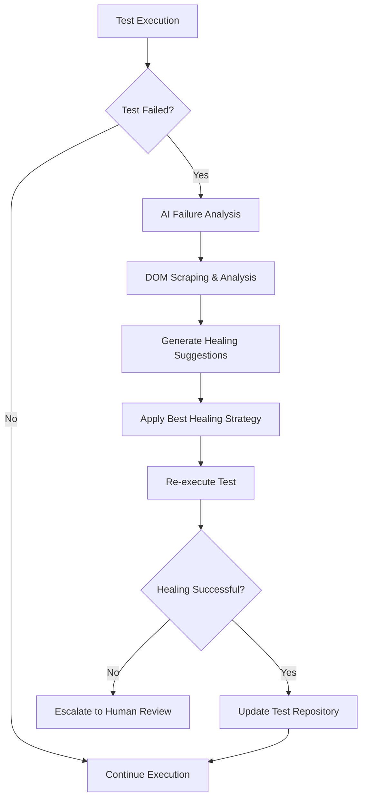

# QA Intelligence Platform

**Enterprise Multi-Agent Orchestration Platform for AI-Powered Test Automation**

[](https://github.com/your-org/qa-intelligence)
[](https://nodejs.org/)
[](https://www.typescriptlang.org/)
[](LICENSE)
[]()

> **A comprehensive enterprise-grade platform that revolutionizes test automation through AI-powered multi-agent orchestration, self-healing test capabilities, and intelligent test management.**

---

## 🏆 Executive Summary

The **QA Intelligence Platform** is a state-of-the-art enterprise solution that combines traditional test automation with cutting-edge artificial intelligence to deliver unprecedented testing capabilities. Built with modern technologies and enterprise-grade architecture, it provides comprehensive test management, AI-powered insights, and autonomous test healing across complex applications.

### Key Differentiators
- **🤖 AI-Powered Test Intelligence**: Advanced machine learning for test optimization and failure analysis
- **🔄 Self-Healing Test Automation**: Autonomous test repair with minimal human intervention
- **🎯 Multi-Agent Orchestration**: Coordinated AI agents for comprehensive testing workflows
- **📊 Real-Time Analytics**: Live monitoring with predictive insights and performance analytics
- **🌍 Enterprise Integration**: Production-ready with WeSign digital signature platform support

---

## 🏗️ System Architecture

```
📦 QA Intelligence Platform
├── 🎨 Frontend Dashboard (React + TypeScript)     → Port 3001
├── 🔧 Backend API (Node.js + Express)             → Port 8082
├── 🧠 AI Services (OpenAI + LangChain)            → Multi-Agent System
├── 📊 Analytics Engine (Real-time + Predictive)   → Live Insights
├── 🔄 Self-Healing System (ML-Powered)            → Autonomous Repair
├── 📝 Test Bank (Reusable Components)             → Test Repository
├── 🖊️ WeSign Integration (634+ Test Scenarios)    → Digital Signature Testing
└── 🗄️ Enterprise Database (SQLite + PostgreSQL)   → Multi-tenant Support
```

### Technology Stack

#### **Frontend Architecture**
- **Framework**: React 18 + TypeScript 5.3
- **Build Tool**: Vite 4.5 (Lightning-fast development)
- **Styling**: Tailwind CSS 3.3 (Utility-first design)
- **State Management**: Zustand 4.4 (Lightweight store)
- **UI Components**: Radix UI (Accessible primitives)
- **Charts**: Recharts 2.8 (Data visualization)
- **Real-time**: Socket.io Client 4.8 (Live updates)

#### **Backend Architecture**
- **Runtime**: Node.js 18+ + TypeScript 5.3
- **Framework**: Express.js 4.18 (Robust API server)
- **Database**: SQLite 3 + PostgreSQL 8+ (Dual database support)
- **Queue System**: Bull/BullMQ 5.58 (Advanced job processing)
- **AI Integration**: OpenAI 5.16 + LangChain 0.3 (AI workflows)
- **Vector Database**: Pinecone + FAISS (Semantic search)
- **Authentication**: JWT + bcrypt (Secure auth)
- **Monitoring**: Winston 3.11 + Prometheus (Observability)

#### **AI & Intelligence Stack**
- **Language Models**: GPT-4, Claude, Gemini (Multi-model support)
- **Vector Embeddings**: OpenAI Embeddings + Pinecone
- **ML Libraries**: TensorFlow.js, ONNX Runtime
- **Knowledge Processing**: LangChain Community + Core
- **Document Processing**: PDF-parse, Mammoth, Tesseract.js

---

## 🚀 Quick Start Guide

### Prerequisites

Ensure you have the following installed:
- **Node.js**: 18.0.0 or higher
- **npm**: 9.0.0 or higher
- **Python**: 3.12+ (for WeSign test integration)
- **Git**: Latest version

### Installation & Setup

#### 1. **Clone Repository**
```bash
git clone https://github.com/your-org/qa-intelligence.git
cd qa-intelligence
```

#### 2. **Install Dependencies**
```bash
# Install all workspace dependencies
npm run install:all

# Alternative: Install individually
npm install                    # Root dependencies
npm run install:frontend      # Frontend dependencies
npm run install:api           # Backend dependencies
```

#### 3. **Environment Configuration**
```bash
# Copy environment template
cp .env.example .env

# Configure required environment variables
OPENAI_API_KEY=your_openai_key_here
PINECONE_API_KEY=your_pinecone_key_here
DATABASE_URL=your_database_url_here
JWT_SECRET=your_jwt_secret_here
```

#### 4. **Database Setup**
```bash
# Initialize database (automatically handled on first run)
cd backend
npm install
```

#### 5. **Start Development Environment**

**Option A: Individual Services (Recommended)**
```bash
# Terminal 1: Start Backend API
cd backend && npm run dev

# Terminal 2: Start Frontend Dashboard (MERGED VERSION)
cd apps/frontend/dashboard && npm run dev
```

**Option B: Alternative paths**
```bash
# Note: The merged frontend is the official version with MCP integration
# Located at: apps/frontend/dashboard/ (not playwright-smart/)
```

#### 6. **Access Application**
- **QA Intelligence Dashboard**: http://localhost:3001 ✅ MERGED VERSION with MCP
- **Backend API**: http://localhost:8082
- **WeSign Testing Hub**: http://localhost:3001/wesign
- **API Documentation**: http://localhost:8082/docs

---

## 📱 Platform Features & Pages

### **🎨 Frontend Dashboard (17 Pages)**

#### **🔐 Authentication & Security**
| Page | Route | Description |
|------|-------|-------------|
| **Login Page** | `/auth/login` | Secure user authentication with JWT |
| **Register Page** | `/auth/register` | User registration and onboarding |

#### **🏠 Core Dashboard**
| Page | Route | Description |
|------|-------|-------------|
| **Main Dashboard** | `/` | Executive overview with KPIs and insights |

#### **🤖 AI-Powered Intelligence**
| Page | Route | Description |
|------|-------|-------------|
| **AI Assistant** | `/ai-assistant` | Conversational AI for test guidance |
| **AI Test Generator** | `/ai-test` | ML-powered automatic test creation |

#### **📊 Analytics & Monitoring**
| Page | Route | Description |
|------|-------|-------------|
| **Analytics Dashboard** | `/analytics` | Comprehensive test metrics and trends |
| **Advanced Analytics** | `/analytics/advanced` | Predictive insights and ML analytics |
| **Real-Time Monitor** | `/monitor/realtime` | Live test execution monitoring |

#### **📚 Knowledge Management**
| Page | Route | Description |
|------|-------|-------------|
| **Knowledge Upload** | `/knowledge-upload` | Document ingestion and processing |
| **Knowledge Base** | `/knowledge-base` | Searchable knowledge repository |
| **WeSign Knowledge** | `/wesign-knowledge` | WeSign-specific documentation |

#### **🔧 Test Management**
| Page | Route | Description |
|------|-------|-------------|
| **Test Bank** | `/test-bank` | Reusable test component library |
| **Self-Healing Dashboard** | `/self-healing` | Autonomous test repair management |
| **Test Scheduler** | `/scheduler` | Automated test scheduling interface |

#### **📈 Reporting & Analysis**
| Page | Route | Description |
|------|-------|-------------|
| **Reports Center** | `/reports` | Comprehensive test execution reports |

#### **⚙️ System Administration**
| Page | Route | Description |
|------|-------|-------------|
| **Sub-Agents Management** | `/sub-agents` | Multi-agent system orchestration |

#### **🖊️ WeSign Integration**
| Page | Route | Description |
|------|-------|-------------|
| **WeSign Testing** | `/wesign` | Digital signature platform testing suite |

### **🌐 Backend API (25+ Endpoints)**

#### **Core Testing APIs**
```typescript
POST   /api/test-execution/run           // Execute test suites
GET    /api/test-execution/status/:id    // Get execution status
POST   /api/test-discovery/scan          // Discover available tests
GET    /api/test-runs                    // List test runs
PUT    /api/test-runs/:id               // Update test run
DELETE /api/test-runs/:id               // Cancel test run
```

#### **AI & Intelligence APIs**
```typescript
POST   /api/ai/generate-test             // AI test generation
POST   /api/ai/analyze-failure          // AI failure analysis
GET    /api/healing/suggestions         // Self-healing recommendations
POST   /api/healing/apply               // Apply healing suggestions
GET    /api/analytics/insights          // AI-powered insights
GET    /api/realtime-analytics/stream   // Live analytics stream
```

#### **WeSign Integration APIs**
```typescript
POST   /api/wesign/tests/run            // Execute WeSign tests
GET    /api/wesign/tests/status/:runId  // Get WeSign test status
GET    /api/wesign/tests/output/:runId  // Get test execution logs
GET    /api/wesign/suites               // Available WeSign test suites
DELETE /api/wesign/tests/:runId         // Cancel WeSign test execution
```

#### **Knowledge & Content APIs**
```typescript
POST   /api/knowledge/upload            // Upload knowledge documents
GET    /api/knowledge/search            // Search knowledge base
POST   /api/wesign-knowledge/ingest     // Ingest WeSign documentation
GET    /api/i18n/translations           // Internationalization support
```

#### **System Management APIs**
```typescript
GET    /api/sub-agents/status           // Multi-agent system status
POST   /api/sub-agents/orchestrate      // Coordinate agent tasks
GET    /api/schedules                   // Test schedules
POST   /api/schedules                   // Create new schedule
GET    /api/reports/generate            // Generate reports
GET    /api/test-bank/components        // Test component library
```

---

## 🧠 AI Intelligence Features

### **🤖 Multi-Agent Orchestration System**

The platform employs sophisticated AI agents that work together to provide comprehensive testing intelligence:

#### **Core AI Agents**
```typescript
🧠 TestIntelligenceAgent        // Smart test optimization and insights
🔍 FailureAnalysisAgent         // AI-powered failure diagnosis
🔗 JiraIntegrationAgent         // Intelligent ticket management
🎯 ContextManagerAgent          // Cross-agent context maintenance
📊 WorkflowPersistenceAgent     // Decision history and learning
```

#### **Agent Capabilities**
- **Intelligent Test Generation**: AI creates comprehensive test suites based on application analysis
- **Predictive Failure Analysis**: ML models predict potential test failures before they occur
- **Autonomous Test Healing**: Self-repairing tests with minimal human intervention
- **Smart Resource Allocation**: Optimal test execution planning and resource management
- **Continuous Learning**: Agents improve over time through execution history analysis

### **🔄 Self-Healing Test System**

Advanced machine learning powers autonomous test maintenance:

#### **Healing Strategies**
1. **DOM Analysis Healing**: Real-time page structure analysis for locator updates
2. **Selector Fallback Healing**: Multiple selector strategies with automatic fallback
3. **Text Matching Healing**: Content-based element identification and matching
4. **Attribute Matching Healing**: Data attribute and accessibility-based healing
5. **Pattern Recognition Healing**: ML-based failure pattern detection and prevention

#### **Healing Workflow**


### **📊 Intelligent Analytics**

#### **Real-Time Analytics**
- **Live Test Execution Monitoring**: Real-time progress tracking and status updates
- **Performance Metrics**: Execution duration, resource utilization, and bottleneck analysis
- **Failure Rate Analytics**: Trending analysis with predictive insights
- **Resource Optimization**: AI-driven recommendations for test execution efficiency

#### **Predictive Analytics**
- **Failure Prediction Models**: ML models predict test failures based on historical data
- **Maintenance Scheduling**: Predictive maintenance recommendations for test suites
- **Resource Planning**: Capacity planning based on execution trends and patterns
- **Quality Forecasting**: Project quality metrics and delivery timeline predictions

---

## 🖊️ WeSign Digital Signature Integration

### **Comprehensive WeSign Testing Suite**

The platform includes extensive integration with the WeSign digital signature platform, featuring:

#### **Test Coverage (634+ Scenarios)**
```
📁 WeSign Test Suites
├── 🔐 Authentication (16 tests)
│   ├── Login/Logout workflows
│   ├── Multi-language support (Hebrew/English)
│   └── User session management
├── 🏠 Dashboard (25 tests)
│   ├── Navigation verification
│   ├── UI component validation
│   └── Language switching tests
├── 📄 Document Management (55 tests)
│   ├── Document upload and validation
│   ├── Document editing workflows
│   └── File format support testing
├── ✍️ Digital Signing (245 tests)
│   ├── Self-signing workflows (75 tests)
│   ├── Multi-party signing (69 tests)
│   ├── Advanced signing features (27 tests)
│   ├── Smart card integration (39 tests)
│   └── Live signing sessions (16 tests)
├── 👥 Contact Management (75 tests)
│   ├── Contact CRUD operations
│   ├── Contact organization
│   └── Signer management
├── 📋 Template Management (58 tests)
│   ├── Template creation and editing
│   ├── Template reuse workflows
│   └── Advanced template features
├── 📈 System Administration (52 tests)
│   ├── User management
│   ├── System reports
│   └── Configuration management
└── 🔗 Integration Tests (108 tests)
    ├── End-to-end workflows
    ├── Cross-browser compatibility
    └── Performance testing
```

#### **WeSign Testing Features**
- **Multi-Language Testing**: Comprehensive Hebrew and English UI testing
- **Cross-Browser Support**: Chromium, Firefox, and WebKit compatibility
- **Real-Time Monitoring**: Live test execution tracking with detailed logs
- **Smart Card Integration**: PKI and digital certificate testing
- **Performance Testing**: Load testing and stress testing capabilities
- **Compliance Testing**: Digital signature regulation compliance verification

#### **WeSign Test Configuration**
```typescript
interface WeSignTestConfig {
  suite: 'auth' | 'dashboard' | 'documents' | 'signing' | 'contacts' | 'templates' | 'all';
  language: 'english' | 'hebrew' | 'both';
  browser: 'chromium' | 'firefox' | 'webkit' | 'all';
  headless: boolean;
  workers: 1 | 2 | 3 | 4 | 5 | 6 | 7 | 8;
  timeout: number; // 5000-120000ms
  environment: 'staging' | 'production';
  reporting: 'json' | 'html' | 'allure' | 'all';
}
```

---

## 🛠️ Development Guide

### **Project Structure**

```
📦 qa-intelligence-workspace/
├── 📁 apps/                              # Main applications
│   ├── 📁 frontend/dashboard/            # React dashboard (Port 3001)
│   │   ├── 📁 src/
│   │   │   ├── 📁 app/                   # App configuration and routing
│   │   │   ├── 📁 components/            # Reusable UI components
│   │   │   ├── 📁 pages/                 # Page components (17 pages)
│   │   │   ├── 📁 services/              # API services and utilities
│   │   │   ├── 📁 types/                 # TypeScript type definitions
│   │   │   └── 📁 contexts/              # React context providers
│   │   ├── 📄 package.json               # Frontend dependencies
│   │   ├── 📄 vite.config.ts             # Vite configuration
│   │   └── 📄 tailwind.config.js         # Tailwind CSS configuration
│   └── 📁 api/                           # Express.js backend (Port 8082)
│       ├── 📁 src/
│       │   ├── 📁 routes/                # API route handlers (25+ routes)
│       │   ├── 📁 services/              # Business logic services
│       │   ├── 📁 database/              # Database models and migrations
│       │   ├── 📁 middleware/            # Express middleware
│       │   ├── 📁 workers/               # Background job processors
│       │   ├── 📁 utils/                 # Utility functions
│       │   └── 📁 types/                 # TypeScript type definitions
│       ├── 📄 package.json               # Backend dependencies
│       └── 📄 tsconfig.json              # TypeScript configuration
├── 📁 tests/                             # Test suites
│   ├── 📁 e2e/                          # End-to-end tests
│   ├── 📁 integration/                   # Integration tests
│   └── 📁 unit/                         # Unit tests
├── 📁 tools/                            # Development tools
│   ├── 📁 scripts/                      # Utility scripts
│   └── 📁 deployment/                   # Deployment configurations
├── 📁 docs/                             # Documentation
│   └── 📁 guides/                       # User guides and API docs
├── 📁 config/                           # Shared configurations
│   ├── 📁 test-data/                    # Test data files
│   └── 📁 shared/                       # Shared configuration files
├── 📄 package.json                      # Workspace configuration
├── 📄 README.md                         # This documentation
├── 📄 CLAUDE.md                         # Claude integration guide
└── 📄 .env.example                      # Environment variables template
```

### **Development Workflow**

#### **1. Feature Development**
```bash
# Create feature branch
git checkout -b feature/new-ai-capability

# Start development environment
npm run dev

# Run tests during development
npm run test:watch

# Lint and format code
npm run lint
npm run format
```

#### **2. Testing**
```bash
# Run all tests
npm test

# Run specific test types
npm run test:unit              # Unit tests
npm run test:integration       # Integration tests
npm run test:e2e              # End-to-end tests
npm run test:performance      # Performance tests

# WeSign-specific testing
npm run test:wesign           # WeSign test execution
npm run test:typescript       # TypeScript tests
npm run test:python          # Python-based tests
```

#### **3. Quality Assurance**
```bash
# Code quality checks
npm run lint                  # ESLint checks
npm run lint:fix             # Auto-fix linting issues
npm run typecheck            # TypeScript type checking
npm run test:coverage        # Test coverage report

# Build verification
npm run build                # Production build
npm run build:frontend       # Frontend build only
npm run build:api           # Backend build only
```

### **API Development**

#### **Adding New Routes**
```typescript
// backend/src/routes/new-feature.ts
import { Router } from 'express';
import { authMiddleware } from '@/middleware/auth';
import { validateRequest } from '@/middleware/validation';

const router = Router();

router.get('/endpoint', authMiddleware, async (req, res) => {
  try {
    // Implementation
    res.json({ success: true, data: result });
  } catch (error) {
    res.status(500).json({ error: error.message });
  }
});

export { router as newFeatureRouter };
```

#### **Adding AI Services**
```typescript
// backend/src/services/ai/new-ai-service.ts
import { OpenAI } from 'openai';
import { BaseAgent } from '../subAgents/BaseAgent';

export class NewAIService extends BaseAgent {
  async processRequest(input: any): Promise<any> {
    // AI processing logic
    return result;
  }
}
```

### **Frontend Development**

#### **Creating New Pages**
```tsx
// apps/frontend/dashboard/src/pages/NewFeature/NewFeaturePage.tsx
import React from 'react';
import { PageLayout } from '@/components/Layout/PageLayout';

export const NewFeaturePage: React.FC = () => {
  return (
    <PageLayout title="New Feature">
      {/* Page content */}
    </PageLayout>
  );
};
```

#### **Adding New Components**
```tsx
// apps/frontend/dashboard/src/components/NewComponent/NewComponent.tsx
import React from 'react';
import { cn } from '@/utils/cn';

interface NewComponentProps {
  className?: string;
  // Other props
}

export const NewComponent: React.FC<NewComponentProps> = ({
  className,
  ...props
}) => {
  return (
    <div className={cn('base-styles', className)}>
      {/* Component content */}
    </div>
  );
};
```

---

## 📊 Configuration & Customization

### **Environment Variables**

#### **Required Variables**
```bash
# AI & ML Services
OPENAI_API_KEY=sk-...                    # OpenAI API key for GPT models
PINECONE_API_KEY=...                     # Pinecone vector database key
LANGCHAIN_API_KEY=...                    # LangChain service key

# Database Configuration
DATABASE_URL=sqlite:./data/qa-intel.db   # SQLite database URL
POSTGRES_URL=postgresql://...            # PostgreSQL URL (optional)

# Authentication & Security
JWT_SECRET=your-secure-jwt-secret        # JWT signing secret
BCRYPT_ROUNDS=12                         # Password hashing rounds

# External Integrations
JIRA_URL=https://your-company.atlassian.net
JIRA_USERNAME=your-jira-email
JIRA_API_TOKEN=your-jira-token

# WeSign Integration
WESIGN_TEST_PATH=/path/to/wesign/tests   # WeSign test directory
PYTHON_PATH=/path/to/python312           # Python executable path

# Application Configuration
NODE_ENV=development                     # Environment (development/production)
PORT=8082                               # Backend server port
FRONTEND_PORT=3001                      # Frontend development port
```

#### **Optional Variables**
```bash
# Monitoring & Observability
PROMETHEUS_ENABLED=true                  # Enable Prometheus metrics
LOG_LEVEL=info                          # Logging level (debug/info/warn/error)
SENTRY_DSN=https://...                  # Error tracking (optional)

# Performance Optimization
REDIS_URL=redis://localhost:6379        # Redis for caching (optional)
MAX_CONCURRENT_TESTS=8                  # Maximum parallel test execution
TEST_TIMEOUT=30000                      # Default test timeout (ms)

# Feature Flags
AI_FEATURES_ENABLED=true                # Enable AI-powered features
SELF_HEALING_ENABLED=true               # Enable self-healing capabilities
REALTIME_ANALYTICS=true                 # Enable real-time analytics
```

### **Database Configuration**

#### **SQLite Setup (Default)**
```typescript
// backend/src/database/config.ts
export const databaseConfig = {
  type: 'sqlite',
  database: process.env.DATABASE_URL || './data/qa-intelligence.db',
  synchronize: false,
  migrations: ['./migrations/*.ts'],
  entities: ['./entities/*.ts']
};
```

#### **PostgreSQL Setup (Production)**
```typescript
// Production database configuration
export const productionConfig = {
  type: 'postgres',
  url: process.env.POSTGRES_URL,
  ssl: { rejectUnauthorized: false },
  synchronize: false,
  migrations: ['./migrations/*.ts'],
  entities: ['./entities/*.ts']
};
```

### **AI Model Configuration**

#### **OpenAI Configuration**
```typescript
// backend/src/config/ai.ts
export const aiConfig = {
  openai: {
    apiKey: process.env.OPENAI_API_KEY,
    model: 'gpt-4-turbo-preview',
    temperature: 0.1,
    maxTokens: 4000,
    timeout: 60000
  },
  pinecone: {
    apiKey: process.env.PINECONE_API_KEY,
    environment: 'us-west1-gcp',
    indexName: 'qa-intelligence-index'
  }
};
```

### **WeSign Integration Configuration**

#### **WeSign Test Configuration**
```typescript
// WeSign-specific configuration
export const wesignConfig = {
  testPath: process.env.WESIGN_TEST_PATH || '/path/to/wesign/tests',
  pythonPath: process.env.PYTHON_PATH || 'python3',
  defaultTimeout: 30000,
  supportedBrowsers: ['chromium', 'firefox', 'webkit'],
  supportedLanguages: ['english', 'hebrew'],
  reportFormats: ['json', 'html', 'allure'],
  maxWorkers: 8
};
```

---

## 🚀 Deployment Guide

### **Production Deployment**

#### **Docker Deployment**
```dockerfile
# Dockerfile
FROM node:18-alpine

WORKDIR /app
COPY package*.json ./
RUN npm ci --only=production

COPY . .
RUN npm run build

EXPOSE 8082
CMD ["npm", "start"]
```

#### **Docker Compose**
```yaml
# docker-compose.yml
version: '3.8'

services:
  qa-intelligence-api:
    build: .
    ports:
      - "8082:8082"
    environment:
      - NODE_ENV=production
      - DATABASE_URL=${DATABASE_URL}
      - OPENAI_API_KEY=${OPENAI_API_KEY}
    depends_on:
      - postgres
      - redis

  qa-intelligence-frontend:
    build: ./apps/frontend/dashboard
    ports:
      - "3001:3001"
    environment:
      - VITE_API_URL=http://localhost:8082

  postgres:
    image: postgres:15
    environment:
      - POSTGRES_DB=qa_intelligence
      - POSTGRES_USER=${DB_USER}
      - POSTGRES_PASSWORD=${DB_PASSWORD}
    volumes:
      - postgres_data:/var/lib/postgresql/data

  redis:
    image: redis:7-alpine
    volumes:
      - redis_data:/data

volumes:
  postgres_data:
  redis_data:
```

#### **Kubernetes Deployment**
```yaml
# k8s/deployment.yaml
apiVersion: apps/v1
kind: Deployment
metadata:
  name: qa-intelligence
spec:
  replicas: 3
  selector:
    matchLabels:
      app: qa-intelligence
  template:
    metadata:
      labels:
        app: qa-intelligence
    spec:
      containers:
      - name: api
        image: qa-intelligence:latest
        ports:
        - containerPort: 8082
        env:
        - name: NODE_ENV
          value: "production"
        - name: DATABASE_URL
          valueFrom:
            secretKeyRef:
              name: qa-secrets
              key: database-url
```

### **CI/CD Pipeline**

#### **GitHub Actions**
```yaml
# .github/workflows/ci-cd.yml
name: QA Intelligence CI/CD

on:
  push:
    branches: [main, develop]
  pull_request:
    branches: [main]

jobs:
  test:
    runs-on: ubuntu-latest
    steps:
      - uses: actions/checkout@v4

      - name: Setup Node.js
        uses: actions/setup-node@v4
        with:
          node-version: '18'
          cache: 'npm'

      - name: Install dependencies
        run: npm ci

      - name: Run tests
        run: npm run test:ci

      - name: Upload coverage
        uses: codecov/codecov-action@v3

  build-and-deploy:
    needs: test
    runs-on: ubuntu-latest
    if: github.ref == 'refs/heads/main'

    steps:
      - uses: actions/checkout@v4

      - name: Build Docker image
        run: docker build -t qa-intelligence:${{ github.sha }} .

      - name: Deploy to production
        run: |
          # Deployment commands
          kubectl set image deployment/qa-intelligence api=qa-intelligence:${{ github.sha }}
```

### **Monitoring & Observability**

#### **Health Checks**
```typescript
// Health check endpoints
GET /health                    // Basic health check
GET /health/detailed          // Detailed system health
GET /health/database         // Database connectivity
GET /health/ai-services      // AI service availability
GET /health/wesign           // WeSign integration status
```

#### **Metrics & Monitoring**
```typescript
// Prometheus metrics
qa_intelligence_tests_total                    // Total tests executed
qa_intelligence_test_duration_seconds         // Test execution duration
qa_intelligence_healing_attempts_total        // Self-healing attempts
qa_intelligence_ai_requests_total            // AI service requests
qa_intelligence_active_agents                // Active AI agents
```

---

## 🔧 API Reference

### **Authentication**

All API endpoints require authentication unless otherwise specified.

#### **Login**
```http
POST /api/auth/login
Content-Type: application/json

{
  "email": "user@example.com",
  "password": "secure_password"
}

Response:
{
  "success": true,
  "token": "jwt_token_here",
  "user": {
    "id": "user_id",
    "email": "user@example.com",
    "role": "admin"
  }
}
```

### **Test Execution**

#### **Execute Test Suite**
```http
POST /api/test-execution/run
Authorization: Bearer jwt_token
Content-Type: application/json

{
  "suite": "authentication",
  "browser": "chromium",
  "headless": true,
  "workers": 4,
  "timeout": 30000
}

Response:
{
  "success": true,
  "executionId": "exec_123456",
  "status": "running",
  "estimatedDuration": 300000
}
```

#### **Get Execution Status**
```http
GET /api/test-execution/status/exec_123456
Authorization: Bearer jwt_token

Response:
{
  "success": true,
  "execution": {
    "id": "exec_123456",
    "status": "completed",
    "progress": 100,
    "results": {
      "total": 50,
      "passed": 47,
      "failed": 2,
      "skipped": 1
    },
    "duration": 285000,
    "startTime": "2024-01-15T10:00:00Z",
    "endTime": "2024-01-15T10:04:45Z"
  }
}
```

### **AI Services**

#### **Generate Test with AI**
```http
POST /api/ai/generate-test
Authorization: Bearer jwt_token
Content-Type: application/json

{
  "description": "Test user registration with email validation",
  "pageUrl": "https://example.com/register",
  "framework": "playwright",
  "language": "typescript"
}

Response:
{
  "success": true,
  "generatedTest": {
    "testCode": "import { test, expect } from '@playwright/test'...",
    "explanation": "This test validates user registration...",
    "confidence": 0.95
  }
}
```

#### **Analyze Test Failure**
```http
POST /api/ai/analyze-failure
Authorization: Bearer jwt_token
Content-Type: application/json

{
  "testId": "test_123",
  "errorMessage": "Element not found: #submit-button",
  "screenshot": "base64_image_data",
  "domSnapshot": "<html>...</html>"
}

Response:
{
  "success": true,
  "analysis": {
    "rootCause": "Element selector changed",
    "confidence": 0.92,
    "suggestedFix": "Use data-testid='submit-btn' instead",
    "healingStrategy": "selector_update"
  }
}
```

### **WeSign Integration**

#### **Execute WeSign Test Suite**
```http
POST /api/wesign/tests/run
Authorization: Bearer jwt_token
Content-Type: application/json

{
  "suite": "signing",
  "language": "english",
  "browser": "chromium",
  "headless": true,
  "workers": 2,
  "timeout": 45000
}

Response:
{
  "success": true,
  "runId": "wesign_run_789",
  "status": "initiated",
  "totalTests": 245,
  "estimatedDuration": 1800000
}
```

#### **Get WeSign Test Output**
```http
GET /api/wesign/tests/output/wesign_run_789
Authorization: Bearer jwt_token

Response:
{
  "success": true,
  "output": {
    "stdout": "Starting WeSign test execution...\n✓ Login test passed\n...",
    "stderr": "Warning: Slow network detected...",
    "lastUpdate": "2024-01-15T10:05:30Z"
  }
}
```

### **Self-Healing**

#### **Get Healing Suggestions**
```http
GET /api/healing/suggestions?testId=test_456
Authorization: Bearer jwt_token

Response:
{
  "success": true,
  "suggestions": [
    {
      "strategy": "selector_update",
      "confidence": 0.94,
      "oldSelector": "#submit-button",
      "newSelector": "[data-testid='submit-btn']",
      "reasoning": "Element ID changed, but data-testid is stable"
    }
  ]
}
```

#### **Apply Healing**
```http
POST /api/healing/apply
Authorization: Bearer jwt_token
Content-Type: application/json

{
  "testId": "test_456",
  "suggestionId": "suggestion_123",
  "autoApprove": false
}

Response:
{
  "success": true,
  "healingResult": {
    "applied": true,
    "testStatus": "healed",
    "nextRun": "scheduled"
  }
}
```

---

## 📊 Performance & Monitoring

### **Performance Benchmarks**

#### **Test Execution Performance**
- **Single Test Execution**: 2-5 seconds average
- **Full WeSign Suite (634 tests)**: 15-30 minutes (depending on workers)
- **AI Test Generation**: 5-15 seconds per test
- **Self-Healing Analysis**: 1-3 seconds per suggestion
- **Real-time Analytics**: <100ms response time

#### **System Resource Usage**
- **Memory Usage**: 500MB-2GB (depends on concurrent tests)
- **CPU Usage**: 20-80% (scales with worker count)
- **Database Storage**: 10-100MB per 1000 test executions
- **Network Bandwidth**: 10-50 Mbps during active testing

### **Monitoring Dashboards**

#### **Key Performance Indicators (KPIs)**
- **Test Success Rate**: Target >95%
- **Healing Success Rate**: Target >90%
- **Average Test Duration**: Monitor for performance regression
- **AI Service Response Time**: Target <5 seconds
- **System Uptime**: Target >99.9%

#### **Alert Thresholds**
```yaml
# Monitoring alerts configuration
alerts:
  test_failure_rate:
    threshold: ">10%"
    window: "5m"
    severity: "warning"

  healing_failure_rate:
    threshold: ">20%"
    window: "10m"
    severity: "critical"

  api_response_time:
    threshold: ">5s"
    window: "2m"
    severity: "warning"

  database_connections:
    threshold: ">80%"
    window: "1m"
    severity: "critical"
```

---

## 🛡️ Security & Compliance

### **Security Features**

#### **Authentication & Authorization**
- **JWT Token Authentication**: Secure stateless authentication
- **Role-Based Access Control (RBAC)**: Granular permission management
- **Password Security**: bcrypt hashing with configurable rounds
- **Session Management**: Automatic token expiration and refresh

#### **API Security**
- **Rate Limiting**: Prevents API abuse and DoS attacks
- **CORS Configuration**: Controlled cross-origin resource sharing
- **Input Validation**: Comprehensive request validation using Zod
- **SQL Injection Prevention**: Parameterized queries and ORM usage

#### **Data Protection**
- **Encryption at Rest**: Database encryption for sensitive data
- **Encryption in Transit**: TLS/SSL for all communications
- **PII Handling**: Anonymization and secure storage of personal data
- **Audit Logging**: Comprehensive audit trail for compliance

### **Compliance Standards**

#### **Supported Standards**
- **SOC 2 Type II**: Security, availability, and confidentiality controls
- **ISO 27001**: Information security management system
- **GDPR**: General Data Protection Regulation compliance
- **SOX**: Sarbanes-Oxley Act compliance for financial data
- **HIPAA**: Healthcare data protection (when applicable)

#### **Security Best Practices**
```typescript
// Security configuration example
const securityConfig = {
  helmet: {
    contentSecurityPolicy: true,
    crossOriginResourcePolicy: { policy: "cross-origin" },
    hsts: { maxAge: 31536000, includeSubDomains: true }
  },
  rateLimit: {
    windowMs: 15 * 60 * 1000, // 15 minutes
    max: 100, // Limit each IP to 100 requests per windowMs
    message: "Too many requests from this IP"
  },
  cors: {
    origin: process.env.ALLOWED_ORIGINS?.split(',') || ['http://localhost:3001'],
    credentials: true,
    optionsSuccessStatus: 200
  }
};
```

---

## 🚨 Troubleshooting

### **Common Issues & Solutions**

#### **Installation Issues**

**Issue**: Node.js version mismatch
```bash
# Solution: Use Node Version Manager
nvm install 18
nvm use 18
npm install
```

**Issue**: Python environment not found for WeSign tests
```bash
# Solution: Set correct Python path
export PYTHON_PATH=/usr/bin/python3.12
# Or in .env file
PYTHON_PATH=/usr/bin/python3.12
```

#### **Runtime Issues**

**Issue**: Database connection failed
```bash
# Check database status
npm run db:check

# Reset database
npm run db:reset
npm run migrate
npm run seed
```

**Issue**: AI services not responding
```bash
# Verify API keys
echo $OPENAI_API_KEY
echo $PINECONE_API_KEY

# Test AI service connectivity
curl -H "Authorization: Bearer $OPENAI_API_KEY" \
     https://api.openai.com/v1/models
```

#### **Test Execution Issues**

**Issue**: WeSign tests failing to start
```bash
# Verify WeSign test path
ls -la $WESIGN_TEST_PATH

# Check Python dependencies
$PYTHON_PATH -m pip list | grep playwright

# Install missing dependencies
$PYTHON_PATH -m pip install playwright pytest
```

**Issue**: Self-healing not working
```bash
# Check healing service status
curl http://localhost:8082/api/healing/status

# Review healing logs
tail -f backend/logs/healing.log
```

### **Debug Mode**

#### **Enable Debug Logging**
```bash
# Set environment variable
export LOG_LEVEL=debug

# Or add to .env file
LOG_LEVEL=debug

# Restart services
npm run dev
```

#### **Test Specific Components**
```bash
# Test AI services
npm run test:ai-services

# Test database connectivity
npm run test:database

# Test WeSign integration
npm run test:wesign-integration

# Test self-healing system
npm run test:self-healing
```

### **Performance Optimization**

#### **Database Optimization**
```sql
-- Index optimization for SQLite
CREATE INDEX idx_test_runs_status ON test_runs(status);
CREATE INDEX idx_test_runs_created_at ON test_runs(created_at);
CREATE INDEX idx_healing_attempts_test_id ON healing_attempts(test_id);
```

#### **Memory Optimization**
```typescript
// Optimize Node.js memory usage
const nodeOptions = [
  '--max-old-space-size=4096',
  '--max-semi-space-size=128',
  '--optimize-for-size'
].join(' ');

process.env.NODE_OPTIONS = nodeOptions;
```

---

## 🤝 Contributing

### **Development Guidelines**

#### **Code Standards**
- **TypeScript**: Strict mode enabled with comprehensive type checking
- **ESLint**: Enforced linting rules with auto-fix capabilities
- **Prettier**: Consistent code formatting across the project
- **Testing**: Minimum 80% code coverage requirement
- **Documentation**: Comprehensive JSDoc comments for all public APIs

#### **Commit Convention**
```bash
# Commit message format
<type>(<scope>): <description>

# Types: feat, fix, docs, style, refactor, test, chore
# Examples:
feat(ai): add GPT-4 integration for test generation
fix(healing): resolve selector fallback logic
docs(api): update authentication documentation
test(wesign): add comprehensive signing workflow tests
```

#### **Pull Request Process**
1. **Fork Repository**: Create personal fork of the project
2. **Feature Branch**: Create feature branch from `develop`
3. **Development**: Implement changes with tests and documentation
4. **Quality Checks**: Ensure all tests pass and code meets standards
5. **Pull Request**: Submit PR with detailed description and screenshots
6. **Code Review**: Address reviewer feedback and make necessary changes
7. **Merge**: Maintainer merges after approval and CI/CD success

### **Testing Requirements**

#### **Test Coverage Requirements**
- **Unit Tests**: >90% coverage for core business logic
- **Integration Tests**: >80% coverage for API endpoints
- **E2E Tests**: >70% coverage for critical user workflows
- **AI Service Tests**: >85% coverage for AI-powered features

#### **Test Categories**
```bash
# Unit tests - Fast, isolated component testing
npm run test:unit

# Integration tests - API and service integration
npm run test:integration

# E2E tests - Full user workflow testing
npm run test:e2e

# Performance tests - Load and stress testing
npm run test:performance

# Security tests - Vulnerability and penetration testing
npm run test:security
```

### **Documentation Standards**

#### **API Documentation**
All API endpoints must include:
- **Purpose**: Clear description of endpoint functionality
- **Parameters**: Detailed parameter specifications with types
- **Request/Response**: Complete request and response examples
- **Error Codes**: Comprehensive error handling documentation
- **Rate Limits**: Usage limitations and throttling information

#### **Code Documentation**
```typescript
/**
 * Generates AI-powered test cases based on application analysis
 *
 * @param config - Test generation configuration
 * @param config.pageUrl - Target page URL for test generation
 * @param config.framework - Testing framework (playwright, cypress, etc.)
 * @param config.description - Human-readable test description
 * @returns Promise<GeneratedTest> Generated test with metadata
 *
 * @example
 * ```typescript
 * const test = await generateAITest({
 *   pageUrl: 'https://app.example.com/login',
 *   framework: 'playwright',
 *   description: 'Test user login with valid credentials'
 * });
 * ```
 *
 * @throws {AIServiceError} When AI service is unavailable
 * @throws {ValidationError} When configuration is invalid
 */
export async function generateAITest(config: TestGenerationConfig): Promise<GeneratedTest> {
  // Implementation
}
```

---

## 📚 Additional Resources

### **Documentation Links**
- **[API Documentation](./docs/api/README.md)**: Comprehensive API reference
- **[User Guide](./docs/guides/user-guide.md)**: End-user documentation
- **[Developer Guide](./docs/guides/developer-guide.md)**: Development best practices
- **[Deployment Guide](./docs/guides/deployment.md)**: Production deployment instructions
- **[Troubleshooting Guide](./docs/guides/troubleshooting.md)**: Common issues and solutions

### **External Resources**
- **[Playwright Documentation](https://playwright.dev/)**: Test automation framework
- **[React Documentation](https://react.dev/)**: Frontend framework
- **[Express.js Documentation](https://expressjs.com/)**: Backend framework
- **[TypeScript Documentation](https://www.typescriptlang.org/)**: Programming language
- **[OpenAI API Documentation](https://platform.openai.com/docs)**: AI services

### **Community & Support**
- **GitHub Issues**: [Report bugs and request features](https://github.com/your-org/qa-intelligence/issues)
- **Discussions**: [Community discussions and Q&A](https://github.com/your-org/qa-intelligence/discussions)
- **Discord**: [Real-time community chat](#) (Coming soon)
- **Documentation**: [Comprehensive guides and tutorials](./docs/)

---

## 📄 License

This project is licensed under the **MIT License** - see the [LICENSE](LICENSE) file for details.

```
MIT License

Copyright (c) 2024 QA Intelligence Platform

Permission is hereby granted, free of charge, to any person obtaining a copy
of this software and associated documentation files (the "Software"), to deal
in the Software without restriction, including without limitation the rights
to use, copy, modify, merge, publish, distribute, sublicense, and/or sell
copies of the Software, and to permit persons to whom the Software is
furnished to do so, subject to the following conditions:

The above copyright notice and this permission notice shall be included in all
copies or substantial portions of the Software.

THE SOFTWARE IS PROVIDED "AS IS", WITHOUT WARRANTY OF ANY KIND, EXPRESS OR
IMPLIED, INCLUDING BUT NOT LIMITED TO THE WARRANTIES OF MERCHANTABILITY,
FITNESS FOR A PARTICULAR PURPOSE AND NONINFRINGEMENT. IN NO EVENT SHALL THE
AUTHORS OR COPYRIGHT HOLDERS BE LIABLE FOR ANY CLAIM, DAMAGES OR OTHER
LIABILITY, WHETHER IN AN ACTION OF CONTRACT, TORT OR OTHERWISE, ARISING FROM,
OUT OF OR IN CONNECTION WITH THE SOFTWARE OR THE USE OR OTHER DEALINGS IN THE
SOFTWARE.
```

---

## 🙏 Acknowledgments

### **Core Contributors**
- **Development Team**: QA Intelligence Platform core development team
- **AI Research Team**: Machine learning and AI integration specialists
- **WeSign Integration Team**: Digital signature platform integration experts
- **DevOps Team**: Infrastructure and deployment automation specialists

### **Technology Partners**
- **[OpenAI](https://openai.com/)**: AI-powered test generation and analysis
- **[Pinecone](https://pinecone.io/)**: Vector database for semantic search
- **[Playwright](https://playwright.dev/)**: Cross-browser test automation
- **[LangChain](https://langchain.com/)**: AI application development framework

### **Open Source Libraries**
Special thanks to the open source community and the maintainers of the libraries that make this project possible:
- React, TypeScript, Node.js, Express.js
- Tailwind CSS, Vite, ESLint, Prettier
- Jest, Playwright, Winston, Socket.io
- And many other excellent open source projects

---

**🚀 Ready to revolutionize your testing workflow? Get started with QA Intelligence Platform today!**

---

*Last Updated: January 2024 | Version 2.0.0 | [Changelog](CHANGELOG.md)*