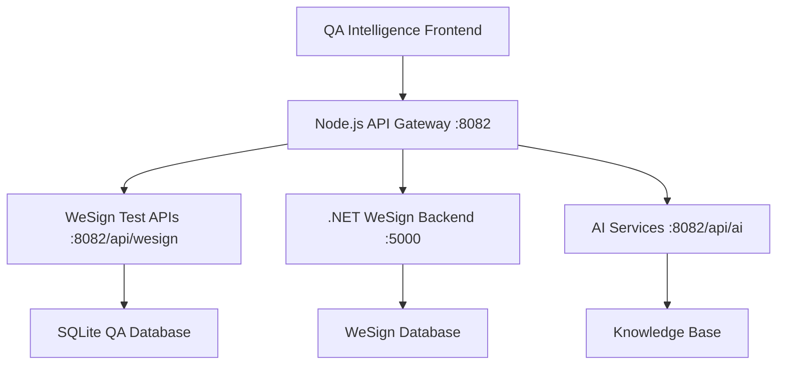

# WeSign Backend Integration Strategy
**Cross-Platform C#/.NET → Node.js/TypeScript Integration**

---

## Executive Summary

**Challenge**: Integrate a comprehensive C#/.NET WeSign backend (`C:\Users\gals\source\repos\user-backend`) into our existing Node.js/TypeScript QA Intelligence platform.

**Scope**: 18 .NET projects including core APIs, business logic, PDF handling, signature services, and desktop components.

**Strategy**: **Hybrid Microservice Integration** with API Gateway pattern for seamless cross-platform operation.

---

## Architecture Analysis

### Source System (C#/.NET WeSign Backend)
```
📁 WeSignV3.sln (18 Projects)
├── 🌐 API Layer
│   ├── WeSign/Areas/Api/Controllers/
│   │   ├── ContactsController.cs (v3/contacts)
│   │   ├── TemplatesController.cs (v3/templates)
│   │   ├── DocumentCollectionsController.cs (v3/documents)
│   │   ├── DashboardController.cs (v3/dashboard)
│   │   ├── SignersController.cs (v3/signers)
│   │   └── UsersController.cs (v3/users)
│   └── Authorization, Swagger, Business Logic Injection
├── 🏢 Business Logic
│   ├── BL/ (Core business logic)
│   ├── SignerBL/ (Signature workflows)
│   └── ManagementBL/ (Management operations)
├── 💾 Data Access
│   ├── DAL/ (Data Access Layer)
│   └── Entity Framework patterns
├── 🔧 Specialized Services
│   ├── PdfHandler/ (PDF processing)
│   ├── SignatureServiceConnector/
│   ├── Certificate/ (Certificate management)
│   └── WSE-ADAuth/ (Active Directory)
└── 🖥️ Desktop Components
    ├── SmartCardDesktopClient/
    └── UserSoapService/
```

### Target System (Node.js/TypeScript QA Intelligence)
```
📁 QA Intelligence Platform
├── 🌐 Express.js API Layer
│   ├── /api/ai (AI services)
│   ├── /api/analytics (Analytics)
│   ├── /api/test-execution (Test automation)
│   └── /api/wesign (Existing test execution - different scope)
├── 🤖 AI Services
│   ├── SmartWeSignKnowledge (PRD integration completed)
│   ├── Advanced NLP Engine
│   └── Agent Orchestrator
├── 💾 Database
│   ├── SQLite (scheduler.db)
│   └── Data persistence services
└── ⚡ Features
    ├── Healing & Analytics
    ├── Knowledge Management
    └── MCP Integration
```

---

## Integration Strategy: **Hybrid Microservice Architecture**

### 🎯 **Strategic Approach**: API Gateway + Service Mesh

#### **Phase 1: Dual-Stack Architecture**


#### **Phase 2: Intelligent API Delegation**
```typescript
// Smart API routing strategy
const routingStrategy = {
  // Existing QA Intelligence APIs (keep in Node.js)
  '/api/ai/*': 'node_service',
  '/api/analytics/*': 'node_service',
  '/api/test-execution/*': 'node_service',

  // WeSign Core APIs (delegate to .NET)
  '/api/wesign/v3/contacts': 'dotnet_service',
  '/api/wesign/v3/templates': 'dotnet_service',
  '/api/wesign/v3/documents': 'dotnet_service',
  '/api/wesign/v3/dashboard': 'dotnet_service',
  '/api/wesign/v3/signers': 'dotnet_service',

  // Hybrid APIs (Node.js + .NET coordination)
  '/api/wesign/ai-enhanced/*': 'hybrid_service'
};
```

---

## Implementation Plan

### **Option 1: API Gateway Integration** ⭐ **RECOMMENDED**

#### **Advantages**:
- ✅ **Zero Code Conversion**: Use existing C# business logic as-is
- ✅ **Technology Independence**: Both stacks run in their optimal environments
- ✅ **Incremental Migration**: Gradually move APIs as needed
- ✅ **Maintainability**: Original .NET codebase remains unchanged
- ✅ **Performance**: Native performance for both platforms

#### **Architecture**:
```typescript
// API Gateway Service
export class WeSignApiGateway {
  private dotnetBaseUrl = 'http://localhost:5000'; // .NET backend
  private nodeBaseUrl = 'http://localhost:8082';   // Node.js backend

  async routeRequest(req: Request): Promise<Response> {
    const route = req.path;

    if (route.startsWith('/api/wesign/v3/')) {
      // Delegate to .NET WeSign backend
      return this.proxyToDotNet(req);
    } else if (route.startsWith('/api/ai/')) {
      // Handle in Node.js with AI services
      return this.handleInNode(req);
    } else if (route.startsWith('/api/wesign/ai-enhanced/')) {
      // Hybrid: Use both .NET data + Node.js AI
      return this.hybridHandler(req);
    }
  }

  private async hybridHandler(req: Request) {
    // 1. Get data from .NET WeSign APIs
    const wesignData = await this.proxyToDotNet(req);

    // 2. Enhance with AI services (Node.js)
    const aiEnhanced = await this.enhanceWithAI(wesignData);

    // 3. Return combined response
    return aiEnhanced;
  }
}
```

#### **Implementation Steps**:
1. **Setup .NET Backend Hosting**
   ```bash
   # Configure .NET backend to run on port 5000
   cd "C:\Users\gals\source\repos\user-backend\WeSign"
   dotnet run --urls="http://localhost:5000"
   ```

2. **Create API Gateway Service**
   ```typescript
   // backend/src/services/wesign/apiGateway.ts
   export class WeSignApiGateway {
     // Proxy configuration and routing logic
   }
   ```

3. **Implement Request Proxying**
   ```typescript
   // Intelligent request forwarding with authentication bridging
   ```

4. **Add Authentication Bridge**
   ```typescript
   // Convert Node.js JWT tokens to .NET compatible auth
   ```

---

### **Option 2: Code Translation**

#### **Approach**: Convert critical C# business logic to TypeScript
#### **Pros**: Single technology stack, easier deployment
#### **Cons**: ⚠️ **High risk**, massive effort, potential bugs, maintenance burden

---

### **Option 3: Container-Based Microservices**

#### **Approach**: Dockerize .NET backend, orchestate with Docker Compose
#### **Architecture**:
```yaml
# docker-compose.yml
services:
  qa-intelligence:
    build: ./backend
    ports: ["8082:8082"]

  wesign-backend:
    build: ./wesign-dotnet
    ports: ["5000:5000"]

  api-gateway:
    build: ./gateway
    ports: ["8080:8080"]
    depends_on: [qa-intelligence, wesign-backend]
```

---

## Database Integration Strategy

### **Challenge**: Entity Framework (.NET) ↔ SQLite/TypeScript

#### **Solution 1: Database Federation**
```typescript
interface DatabaseStrategy {
  // WeSign core data (Entity Framework)
  wesignDb: 'SQL Server / PostgreSQL (via .NET)',

  // QA Intelligence data (existing)
  qaDb: 'SQLite (Node.js)',

  // Integration layer
  syncService: 'Bidirectional data sync for shared entities'
}
```

#### **Solution 2: API-Based Data Access**
```typescript
// No direct database sharing - all data access via APIs
class WeSignDataService {
  async getContacts(): Promise<Contact[]> {
    return this.apiGateway.get('/api/wesign/v3/contacts');
  }

  async createDocument(doc: Document): Promise<Document> {
    return this.apiGateway.post('/api/wesign/v3/documents', doc);
  }
}
```

---

## AI Integration Enhancement

### **Smart WeSign + AI Services**
```typescript
// Enhanced WeSign APIs with AI capabilities
router.get('/api/wesign/ai-enhanced/dashboard', async (req, res) => {
  // 1. Get dashboard data from .NET backend
  const dashboardData = await wesignApiGateway.get('/v3/dashboard');

  // 2. Enhance with AI insights
  const aiInsights = await smartWeSignKnowledge.generateInsights(dashboardData);

  // 3. Add predictive analytics
  const predictions = await predictiveAnalytics.analyzeTrends(dashboardData);

  // 4. Return enhanced dashboard
  res.json({
    ...dashboardData,
    aiInsights,
    predictions,
    recommendations: await aiService.getRecommendations(dashboardData)
  });
});
```

---

## Port and Hosting Strategy

### **Multi-Service Configuration**
```typescript
// Service orchestration
const services = {
  qaIntelligence: {
    port: 8082,
    tech: 'Node.js/TypeScript',
    role: 'AI, Analytics, Test Automation'
  },

  wesignBackend: {
    port: 5000,
    tech: '.NET Core',
    role: 'WeSign Core APIs, Business Logic'
  },

  apiGateway: {
    port: 8080, // Main entry point
    tech: 'Node.js Proxy',
    role: 'Request routing, Authentication, CORS'
  }
};
```

### **Development vs Production**
```typescript
// Development: All services on localhost
const devConfig = {
  qaIntelligence: 'http://localhost:8082',
  wesignBackend: 'http://localhost:5000',
  frontend: 'http://localhost:3001'
};

// Production: Containerized services
const prodConfig = {
  qaIntelligence: 'http://qa-service:8082',
  wesignBackend: 'http://wesign-service:5000',
  gateway: 'http://api-gateway:8080'
};
```

---

## Security and Authentication

### **Authentication Bridge**
```typescript
class AuthenticationBridge {
  // Convert Node.js JWT to .NET compatible auth
  async bridgeAuthentication(nodeJwt: string): Promise<string> {
    const nodePayload = jwt.verify(nodeJwt, NODE_SECRET);
    const dotnetToken = jwt.sign(nodePayload, DOTNET_SECRET, {
      expiresIn: '1h',
      issuer: 'qa-intelligence',
      audience: 'wesign-backend'
    });
    return dotnetToken;
  }
}
```

### **CORS and Security Headers**
```typescript
// Unified CORS policy for cross-service communication
const corsConfig = {
  origin: ['http://localhost:3001', 'http://localhost:8080'],
  methods: ['GET', 'POST', 'PUT', 'DELETE'],
  allowedHeaders: ['Authorization', 'Content-Type'],
  credentials: true
};
```

---

## Migration Timeline

### **Phase 1: Foundation** (Week 1-2)
- [ ] Setup .NET backend hosting (port 5000)
- [ ] Create API Gateway service in Node.js
- [ ] Implement basic request proxying
- [ ] Test core API connectivity

### **Phase 2: Integration** (Week 3-4)
- [ ] Authentication bridge implementation
- [ ] Database strategy implementation
- [ ] Error handling and logging
- [ ] Performance optimization

### **Phase 3: Enhancement** (Week 5-6)
- [ ] AI service integration with WeSign APIs
- [ ] Enhanced dashboard with AI insights
- [ ] Bilingual knowledge enhancement
- [ ] Comprehensive testing

### **Phase 4: Production** (Week 7-8)
- [ ] Containerization (optional)
- [ ] Load balancing configuration
- [ ] Monitoring and health checks
- [ ] Documentation and training

---

## Risk Mitigation

### **Technical Risks**
| Risk | Impact | Mitigation |
|------|--------|------------|
| **Port Conflicts** | High | Use service discovery, configurable ports |
| **Authentication Issues** | High | Implement robust auth bridge with fallbacks |
| **Performance Overhead** | Medium | Optimize proxy layer, implement caching |
| **Database Sync** | Medium | API-first approach, avoid direct DB sharing |

### **Business Risks**
| Risk | Impact | Mitigation |
|------|--------|------------|
| **Complex Deployment** | Medium | Containerization, automated deployment |
| **Maintenance Overhead** | Low | Keep .NET codebase unchanged, minimal Node.js changes |
| **Learning Curve** | Low | Leverage existing expertise in both stacks |

---

## Success Metrics

### **Technical KPIs**
- ✅ **API Response Time**: < 200ms for proxied requests
- ✅ **Uptime**: 99.9% for both services
- ✅ **Error Rate**: < 0.1% for gateway operations
- ✅ **Memory Usage**: Efficient resource utilization

### **Business KPIs**
- ✅ **Feature Completeness**: 100% WeSign API coverage
- ✅ **AI Enhancement**: Enhanced responses with AI insights
- ✅ **User Experience**: Seamless cross-platform operation
- ✅ **Development Velocity**: Faster feature delivery

---

## Conclusion

The **Hybrid Microservice Integration** strategy provides the optimal balance of:

- 🚀 **Rapid Implementation**: Leverage existing codebases
- 🛡️ **Risk Mitigation**: Minimal changes to working systems
- 📈 **Scalability**: Independent service scaling
- 🔮 **Future Flexibility**: Easy to evolve and optimize

**Next Step**: Begin Phase 1 implementation with API Gateway foundation.

---

**Generated**: 2025-09-15
**System**: QA Intelligence Platform v2.0
**Integration**: WeSign Backend Embedding Strategy
**Status**: 🎯 Ready for Implementation